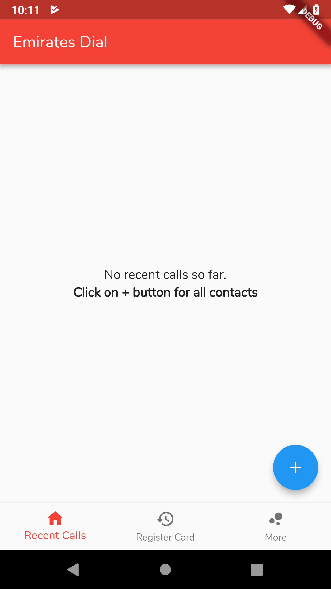
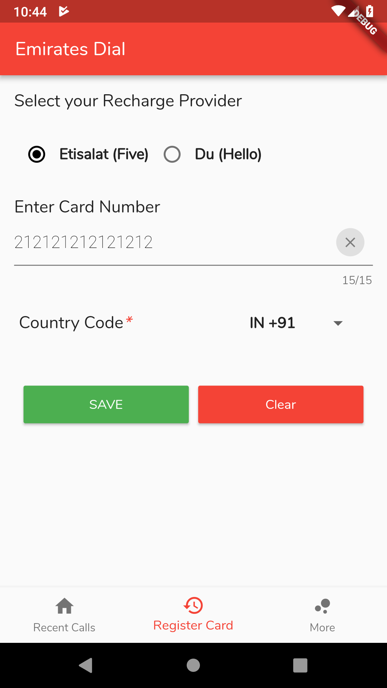
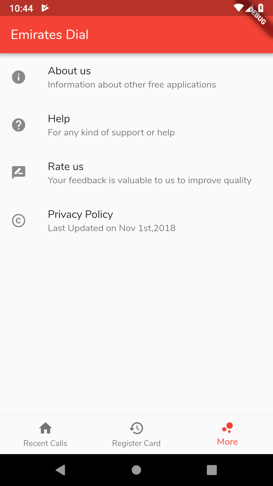
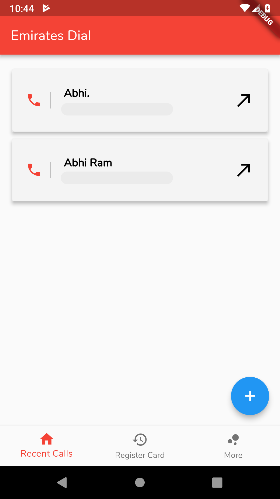

# Flutter EmiratesDialer

Building a EmiratesDial in Flutter.
This app helps expats to call their countries with low cost call rate and automate calling process for hello and five celluar card from Du and Etisalat network

[Install from Playstore](https://play.google.com/store/apps/details?id=com.driftycode.emiratesdialer)

### Show some :heart: and star the repo to support the project

### Screenshots
    

### Created & Maintained By

[Nagendra Badiganti](https://github.com/nbadiganti) ([@nagendrabadigan](https://www.twitter.com/nagendrabadigan)) 
([Insta](https://www.instagram.com/nbadiganti))

> If you found this project helpful or you learned something from the source code and want to thank me, consider buying me a cup of :coffee:
>
> * [PayPal](https://www.paypal.me/codingcursor/)

# License

    Copyright 2018 Nagendra Badiganti

    Licensed under the Apache License, Version 2.0 (the "License");
    you may not use this file except in compliance with the License.
    You may obtain a copy of the License at

       http://www.apache.org/licenses/LICENSE-2.0

    Unless required by applicable law or agreed to in writing, software
    distributed under the License is distributed on an "AS IS" BASIS,
    WITHOUT WARRANTIES OR CONDITIONS OF ANY KIND, either express or implied.
    See the License for the specific language governing permissions and
    limitations under the License.

## Getting Started

For help getting started with Flutter, view our online
[documentation](https://flutter.io/).
